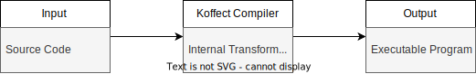

# Koffect

## Table of Contents

<!-- TOC -->
* [Koffect](#koffect)
  * [Table of Contents](#table-of-contents)
  * [Team Information](#team-information)
    * [Team Information](#team-information-1)
    * [Team Name: ZJY](#team-name-zjy)
    * [Team Members](#team-members)
    * [Project Advisor](#project-advisor)
  * [Project Description](#project-description)
    * [Project Description](#project-description-1)
    * [Topic Area](#topic-area)
    * [Project Goals](#project-goals)
  * [User Stories and Design Diagrams](#user-stories-and-design-diagrams)
    * [User Stories](#user-stories)
    * [Design Diagrams](#design-diagrams)
      * [Design Level 1 (D0)](#design-level-1-d0)
      * [Design Level 2 (D1)](#design-level-2-d1)
      * [Design Level 3 (D2)](#design-level-3-d2)
  * [Project Task and Timeline](#project-task-and-timeline)
    * [Task List](#task-list)
  * [Milestone Timeline and Effort Matrix](#milestone-timeline-and-effort-matrix)
    * [Milestones](#milestones)
    * [Deliverables](#deliverables)
    * [Timeline](#timeline)
  * [Project Constraints](#project-constraints)
    * [Project Constraints](#project-constraints-1)
  * [Project Powerpoint](#project-powerpoint)
    * [Project Powerpoint](#project-powerpoint-1)
  * [Capstone Assessment](#capstone-assessment)
    * [Capstone Assessment](#capstone-assessment-1)
  * [Professional Biographies](#professional-biographies)
    * [Professional Biography](#professional-biography)
    * [Name: Jaran Chao](#name-jaran-chao)
      * [Skillset / Project Sought](#skillset--project-sought)
    * [Co-op Work Experience](#co-op-work-experience)
      * [AWS | SDE I | May 2022 - Aug 2022 | Jan 2023 - Mar 2023](#aws--sde-i--may-2022---aug-2022--jan-2023---mar-2023)
    * [Contact Information](#contact-information)
  * [Budget](#budget)
  * [Appendix](#appendix)
    * [Team Contract](#team-contract)
    * [GitHub Repository](#github-repository)
    * [Hours of Effort](#hours-of-effort)
<!-- TOC -->

## Team Information

### [Team Information](./Project_Description.md)

### Team Name: ZJY

### Team Members

- **Jaran Chao**
    - Major: Computer Science
    - Email: [chaojl@mail.uc.edu](chaojl@mail.uc.edu)

### Project Advisor

- **Dr. William Hawkins III**
    - Email: [hawkinwh@ucmail.uc.edu](hawkinwh@ucmail.uc.edu)

## Project Description

### [Project Description](./Project_Description.md)

### Topic Area

This project is a research-oriented project focusing on the applications of context-oriented/context-aware programming
to general purpose programming. From applications of contextual rigor (such as mathematical proof writing), to resource
management (such as opening and closing files/connections/sockets), to domain specific languages, programming contains
a lot of implicit contexts and mental context management. This project aims to create a language around the concept of
explicit contexts to reduce the mental gymnastics and boilerplate needed to maintain context dependent code.

### Project Goals

The goal of this project is to research and implement a general purpose programming language specializing in
context-oriented programming.

Some areas of focus that this project hopes to tackle are:
- The application of context-oriented programming to tackle metaprogramming challenges
- The application of context-oriented programming to model other context dependent fields such as mathematical proofs
- The application of context-oriented programming to model real world contextual dependent situations in code with minimal boilerplate
- The application of context-oriented programming to the creation and modelling of domain specific languages

## User Stories and Design Diagrams

### [User Stories](./CS5001UserStories.md)

1. As a software developer, I want the language to be expressive and powerful enough to express my complex business logic and business solution. Preferably in an idiomatic, elegant, and concise manner.
2. As a library maintainer, I want the language features to be composable such that libraries are able to be used together without causing conflicts, bugs, and undefined behavior.
3. As a software maintainer, I want the language to have good tooling for creating maintainable and scalable code solutions and documentation solutions.
4. As a software developer, I want the language to have compatibility with multiple platforms so that Koffect code can be run from multiple different hardware architectures. Furthermore, I want the language to have a good multiplatform story to allow for Koffect to be utilized for many different applications.
5. As a user, I expect programs and applications written in Koffect to be stable and consistent. Behavior of the program/application should be well-defined.

### [Design Diagrams](./CS5001DesignDiagrams.md)

#### Design Level 1 (D0)

#### Design Level 2 (D1)

#### Design Level 3 (D2)

## Project Task and Timeline

### [Task List](./CS5001TaskList.md)

- [ ] Refine and finalize Koffect syntax
    - [ ] Document Koffect syntax
- [ ] Refine and finalize Koffect semantics
    - [ ] Document Koffect semantics
- [ ] Refine and finalize Koffect feature set
    - [ ] Document Koffect feature set
- [ ] Research async solutions and determine which best fits in the current language semantics
    - [x] Document initial findings and reach an initial conclusion
        - see [design_notes/async.md](../design_notes/async.md)
    - [ ] Specify async solution for Koffect and reach a definitive conclusion
        - [ ] Document tradeoffs and consequences made in final solution and impact on design of the language
- [ ] Research multiplatform solutions and determine which best fits for the (planned) language ecosystem
    - [ ] Document initial findings and reach an initial conclusion
    - [ ] Specify multiplatform solution for Koffect and reach a definitive conclusion
        - [ ] Document tradeoffs and consequences made in final solution and impact on design of the language
- [ ] Research language correctness and determine the level of correctness that should be guaranteed by the language
    - [ ] Document initial findings and reach an initial conclusion
    - [ ] Specify how correctness will be maintained and guaranteed by the language
        - [ ] Document tradeoffs and consequence made in final solution and impact on design of the language
- [ ] Document Koffect language opinions/philosophies
    - [ ] Document language opinions/philosophies pertaining to metaprogramming through context-oriented code
    - [ ] Document language opinions/philosophies pertaining to code correctness through context-oriented code
    - [ ] Document language opinions/philosophies pertaining to the use cases of context-oriented programming to
      everyday coding problems
    - [ ] Document language opinions/philosophies pertaining to the creation and maintenance of internal domain specific
      languages
- [ ] Design and develop Koffect lexer
- [ ] Design and develop Koffect parser
- [ ] Design and develop Koffect code generator
- [ ] Design and develop Koffect runtime (depends on outcome from multiplatform solutions research)
- [ ] Design and develop Koffect code optimizer
- [ ] Design and develop Koffect standard library
- [ ] Design and develop Koffect unit testing framework
- [ ] Design and develop Koffect documentation generator
- [ ] Research feasibility of implementing a REPL for Koffect
    - [ ] Document any and all tradeoffs, consequences, and design divergences that may be needed
- [ ] Research feasibility of separating out the language into two separate file formats, one format for AOT compilation
  and another format for scripting
    - [ ] Specify the differing file extensions if research is conclusive
- [ ] Validate code behavior is well-defined and consistent
- [ ] Research build solutions and determine which is the best solution for first party build tooling
    - [ ] Document initial findings and reach an initial design
    - [ ] Specify build solution for Koffect
        - [ ] Document build tooling
        - [ ] Document architecture and project structure opinions/philosophies
    - [ ] Design dependency management solution as part of builtin build tooling
- [ ] Research how to make the language compiler a library for easier tooling creation
    - [ ] Document the API for usage in creating other tools
    - [ ] Design and develop Language Server Protocol for Koffect
    - [ ] Design and develop Linter for Koffect
- [ ] Research algebraic effects/coeffects and determine how they map to contexts and context objects
- [ ] Research possible case studies for implementing common solutions that can benefit from contexts and contextual
  objects
    - Examples (source: [Effekt Case Studies](https://effekt-lang.org/docs/casestudies)):
        - Pull-based Lexer
        - Backtracking Parsers
        - Pretty Printers
        - ANF Transformation
        - Automatic Differentiation
        - Naturalistic DSLs

## Milestone Timeline and Effort Matrix

### [Milestones](./CS5001MilestonesTimelineEffortMatrix.md)

1. Finalization of Koffect specification. This includes a finalization of syntax, of semantics, and of feature set. This will allow for the language to have a sense of direction and has the biggest influence over all other aspects of the language implementation (lexer, parser, code generation). This milestone is one of the many that are needed for the fabled 1.0 release. This milestone may not happen before initial completion of many aspects of the language and is closely tied to the 1.0 release milestone. However, this milestone may occur before or after the 1.0 release.
2. 1.0 release. The fabled 1.0 release as it shows that a language has matured to a stable state. The 1.0 release also implies that the language is set in stone and will not have major breaking changes that break backwards compatibility (these are often saved for major version bumps, see Python 2 to 3 and Scala 2 to 3). As stated above, new features and new syntax may be added to the language after the 1.0 release, but no major breaking changes will be added.
3. Development of lexer, parser, code generation, and runtime. Completion of these stages of the compiler will allow for basic usage of the language and testing of language semantics and syntax. This milestone is the catalyst for the rest.
4. Development of standard library, unit testing framework, and documentation generator. Completion of a standard library, unit test framework, and documentation generator signifies that a language has some level of batteries included and is nearing maturity and 1.0.
5. Answering and developing the async, multiplatform, and build tooling solutions. Completion of the async story is very important in the modern programming language world as more and more applications are utilizing good asynchronous code solutions. With the prevalence of technology, multiplatform support is also heavily needed as it allows for developers to utilize a language for the many common targets that exist. Build tooling and good dependency management allow for a better batteries included solution and allow for the fostering of a community for the language that constantly build libraries and frameworks to complete more and more tasks, making the language more and more general purpose.

### Deliverables

1. Koffect Compiler and Runtime: This is the main product of this project. It will be the program(s) to compile and run Koffect programs
2. Koffect Specification and Documentation: This is the secondary product of this project. It will be the main source of information about the Koffect program.

### Timeline

Due to the nature of how programming languages are created and evolve over time, many tasks are not set in stone on specific timelines but will evolve when more structure and maturity are achieved.

| Task | Timeline | Comments | Effort |
| --- | --- | --- | --- |
| Finalize Specification | Weeks 1-3 | Can be done concurrently with the other tasks but would like to be completed before code generation has started | Jaran (100%) |
| Develop Lexer | Weeks 1-2 |  | Jaran (100%) |
| Develop Parser | Weeks 2-3 | Depends on Lexer | Jaran (100%) |
| Develop Code Generation | Weeks 3-5 | Depends on Parser | Jaran (100%) |
| Develop Code Optimizer | Weeks 3-7 | Depends on Parser and can be done concurrently with Code Generation | Jaran (100%) |
| Research Async Story | Concurrent | Can be completed concurrently with all other tasks | Jaran (100%) |
| Research Multiplatform Story | Concurrent | Can be completed concurrently with all other tasks | Jaran (100%) |
| Research Build Tooling Story | Concurrent | Can be completed concurrently with all other tasks | Jaran (100%) |
| Develop Standard Library | Week 6+ | Timeline is fuzzy, can be completed concurrently with other tasks once basic language execution facilities are completed | Jaran (100%) |
| Develop Unit Testing Framework | Week 6+ | Timeline is fuzzy, can be completed concurrently with other tasks once basic language execution facilities are completed | Jaran (100%) |
| Develop Documentation Generator | Week 6+ | Timeline is fuzzy, can be completed concurrently with other tasks once basic language parsing facilities are completed | Jaran (100%) |
| Create Language Documentation | Concurrent | Can be completed concurrently with all other tasks | Jaran (100%) |

## Project Constraints

### [Project Constraints](./CS5001ProjectConstraints.md)

The creation of the Koffect programming language, as with the creation of any programming language, has many constraints. The aim of this document is to highlight the initial constraints that are believed to play the biggest factor in the success of this project. The main constraints pertaining to this project are time, economic, professional, and ethical. As always with these types of documents, these are an initial guess of what types of constraints the project will face and cannot predict what constraints may arise once development is underway.

As for any project, time is always a factor. While this may be considered a universal constraint that is implicitly defined for all projects, it should still be called out for the Koffect project as programming languages are complex pieces of software that have many moving parts for them to considered mature. Not only does maturity require a working language compiler/interpreter and language runtime, but it also requires a wide range of batteries included through the standard library and first-party support libraries and APIs. Furthermore, in this modern era of programming languages, a language’s maturity is further defined by the ability for the language to bolster a community through the creation and maintenance of tooling such as a developer tooling (Language Server Protocol, Code Linter, Unit Test Frameworks), and build/distribution tooling (build system, dependency management, documentation generation). For this reason, while many of aforementioned pieces of software are not required for the project to be considered a successful deliverable, they are a major step into solidifying that the project has hit a level or maturity.

There are also economic constraints in play. Many of the later development milestones, such as a Language Server Protocol, plan to integrate into pre-defined well-established ecosystems, a framework or library is required to cut down on the amount of grunt work. While these later milestones could be hand-rolled, utilization of free and open-source frameworks and libraries to implement many of the finer details in creating these milestones will be of great help. Furthermore, the economic constraints also play into the ethical constraints as well. Since this project will be utilizing other free and open-source software, the project itself will be under a free and open-source license (GNU General Public License v3.0). This license will is not a restrictive license by any means, however, it may conflict with other licenses which may lead to restrictions on what other open-source software can be utilized for this project. Furthermore, the license allows for public and private distribution. As this project is a programming language without accompanying software, it does not make sense to lock the software behind a paywall. All that is asked when distributing is acknowledgement of the project. Lastly, the project license will not transfer warranty and liability from the distributed software, therefore this project may not be held responsible for any malicious acts and applications created from the use of this programming language.

Finally, the last major constraint affecting the project are professional constraints. I first and foremost do not have any professional development experience in programming languages development, compilers software, or interpreters software. Therefore, this project, if successful, would prove my credibility in this field professionally. I, however, must note I have delved into this area of software development personally on my own time, but the fact still remains I do not have formal academic or industrial experience in the topic. In terms of needed expertise, most of the concepts pertaining to design and implementation are fairly ad-hoc and subjective. Therefore, differing perspectives may be requested from the Programming Languages Discord or Reddit as well from my project advisor and professors who teach the compilers course at UC.

As a final note, this is an initial guess of the constraints faced by this project and therefore are not guaranteed to be accurate. More constraints may appear further down the line during development and maintenance, or a misunderstanding may be present and reevaluation of constraints may occur down the line as well. Furthermore, in regards to the license and ethical constraints, I am not a lawyer nor have had any formal legal and law training, so do not take this document as legal advice. Please always first talk to a lawyer. If you are looking to use this project and are unsure if it is valid use, please refer yourself to the formal LICENSE file in this repository. If after that you are still confused, please do not hesitate to reach out to get in contact.

## Project Powerpoint

### [Project Powerpoint](./CS5001_Fall_Design_Presentation.pptx)

## Capstone Assessment

### [Capstone Assessment](./CS5001CapstoneAssessment.md)

From my academic perspective, my senior design project is about expressing and applying all of the knowledge, skills, and experiences I have acquired from my class and co-op experiences, focusing them into a project I am truly passionate and dedicated to. While my current classes and co-ops rarely covered the topics of programming language theory and development, the experiences I have had over my class and co-op semesters will help put my design and implementation into perspective. From all the classes that I have and/or are currently taking that discuss numerical approximation and scientific computing, I hope to best use the material they covered to further guide my design and implementation choices on this project.

Classes that have discussed topics pertaining to the area of focus for this project are Programming Languages (CS 3003), Numerical Analysis (MATH 5106), and Formal Languages and Automata Theory (CS 5170). CS 3003 covered many different programming paradigms and how different programming languages adhere to said paradigms. CS 3003 also covered basic lexers, parsers, and interpreters which are core aspects of a programming language compiler/interpreter. MATH 5106 covers many different techniques to analysis the accuracy of a numerical algorithm. This class has also shown me what support is needed from the programming language itself to be able to have good support for scientific computing. While this project will focus on creating a language for general computing purposes, the applications of context-oriented programming have many uses in scientific computing so it will still be a subarea of focus for the project. Lastly, CS 5170 talks about the theoretical and mathematical nature behind the foundation of programming languages: the language and grammar.

While none of my co-op experiences have dealt with programming language theory and design, the co-op experiences have shown me a great deal about the daily industrial use of languages. From my own work experience and the experience of others, I hope to be able to apply the lessons learned to improve the design, implementation, and documentation of my project. These experiences have better allowed for me to understand the needs of software developers when using a language that is design for a general application or domain specific applications. This would allow for me to better design the language to tackle the modern challenges faced by software and software developers in industry.

I am excited to work on this project because I believe there is an application of context-oriented programming that the current wider programming language community has not fully explored. Context is implicitly defined in many places in our lives, not just in code, and often times can lead to confusion and misinterpretation, especially in code. So I thought, why not make a language that explicitly defines contexts and their introduction into scope. Many modern programming tasks already have implicit context definitions, so explicitly stating them would greatly decrease the mental gymnastics required to read and write code. A main reason why I wanted to explore the requirement of explicitly stating context is because when writing code developers have so many tools to help them keep track of all of these implicit contexts (see IDEs such as Intellij or Visual Studio which have inlay hints, powerful refactoring tools, and goto definition/declaration functionality). When reading code, especially on the internet through github or other cloud hosting services, these tools may not exist and the burden of maintaining implicit context skyrockets.

A programming language is ever evolving and may be considered never finished, but for the purposes of this senior design I hope to have a language that is turing complete, can be used for small to medium personal projects, and has a minimal standard library to handle many basic functionalities that are expected of a programming language (IO, Math, utility data structures). I also expect to maintain documentation to help explain and teach the programming language to those who are interested. I hope to be able to use this programming language to further my interests in programming language theory and development and numerical and scientific computing and allow me to express my code in a context-oriented manner.

## Professional Biographies

### [Professional Biography](./Project_Biography.md)

### Name: Jaran Chao

#### Skillset / Project Sought

I am highly passionate about Programming Language Theory and Design (PLTD), focusing specifically on its applications to Numerical and Scientific computing. Specifically, I am interested in how programming languages affect the code we write day to day and how different paradigms and perspectives in language choice allow for expressive and elegant solutions with a focus on numerical methods, mathematical theory, and scientific computing.

I am experienced with many advanced mathematical topics such as Linear Algebra, Multivariable Calculus, Differential Equations, and Discrete Mathematics primarily focusing on symbolic and numerical computation. I also have experience in lexing, parsing, type theory, ISA design, code generation, and compiler design. I bring a diverse set of skills for addressing any PLTD, numerical, or scientific computing workloads.

### Co-op Work Experience

#### AWS | SDE I | May 2022 - Aug 2022 | Jan 2023 - Mar 2023

Company: Amazon Web Services

Team: WSP Control Plane

Title: Software Development Engineer 1

Location: Seattle

May 2022 - Aug 2022

- Designed, implemented, and maintained a new internal system to further improve AWS WSP Control Plane production system security
- Responsible for ensuring accordance to an internal initiative across Amazon Web Services to increase overall production security
- Leveraged an internal tooling framework that limited employee access of production critical systems to very specific actions/scripts, focusing on developer and user experience to not impede on productivity and ease of use, allowing for smooth day-to-day operational workflows
- Utilized **Python, Amazon EC2, and AWS Cloudformation** to create powerful and scalable developer tooling

Jan 2023 - Mar 2023

- Designed, implemented, and defined critical takeaways for a proof-of-concept architecture for the AWS WSP Control Plane infrastructure
- Provided increased security through separation of mission critical systems and decreased cost by an initial estimate of 50%
- Utilized server-less and containerization technologies to migrate the existing architecture to a microservices architecture, to provide confidence and initial data for the AWS WSP Control Plane team to utilize in future migrations, and to document the tradeoffs of moving to this new architecture and these new technologies
- **Java, Amazon CDK, Amazon DynamoDB, AWS Lambda, Amazon API Gateway, AWS Cloudformation**

### Contact Information

Discord: @wukongrework.exebroke

LinkedIn: [https://www.linkedin.com/in/jaranchao/](https://www.linkedin.com/in/jaranchao/)

Phone Number: (513) 473-9371

Email: [chaojl@mail.uc.edu](chaojl@mail.uc.edu)

## Budget

There have not been any monetary expenses tied to this project and are none planned for the future. All software created and utilized is open-source and free-to-use (follwing the license). 

## Appendix

### [Team Contract](./CS5001TeamContract.md)

### [GitHub Repository](https://github.com/JarnaChao09/Koffect)

### Hours of Effort

As of writing, most of the project hours have been put into research and design considerations. The following are approximations of the time allocation for current project work:

- Researching and documenting async paradigms (see [async.md](../design_notes/async.md)): ~15 hours
- Researching and documenting correctness (see [correctness.md](../design_notes/correctness.md)): ~10 hours
- Designing and documenting syntax and semantics around contexts (see [context.md](../design_notes/context.md)): ~10 hours (and counting)
- Following [Type Inference by Example](https://github.com/Ahnfelt/type-inference-by-example) (see [prototype.typeInferenceByExample](../src/main/kotlin/prototype/typeInferenceByExample)): ~10 hours
- Completing all required CS5001 Assignments: ~10 hours

Total hours = ~55 hours